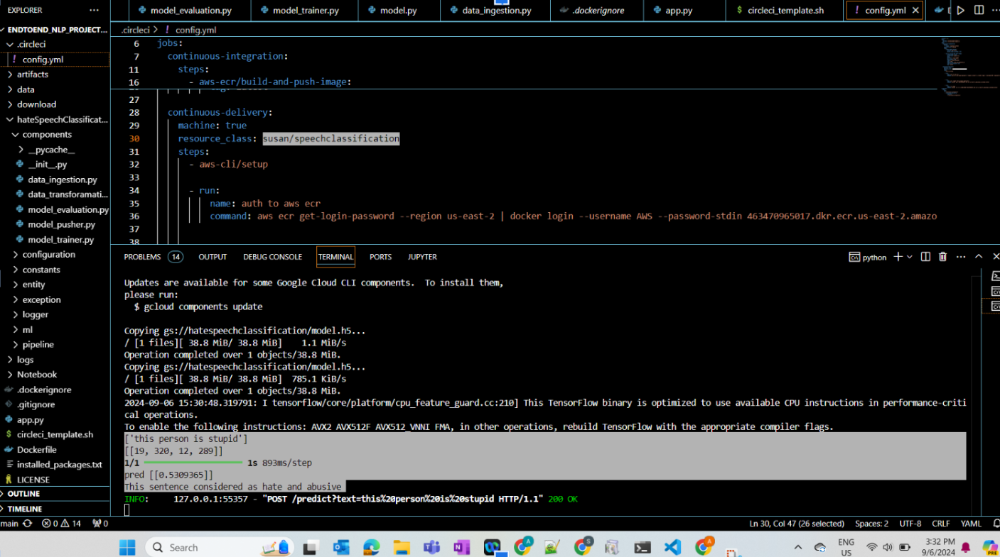
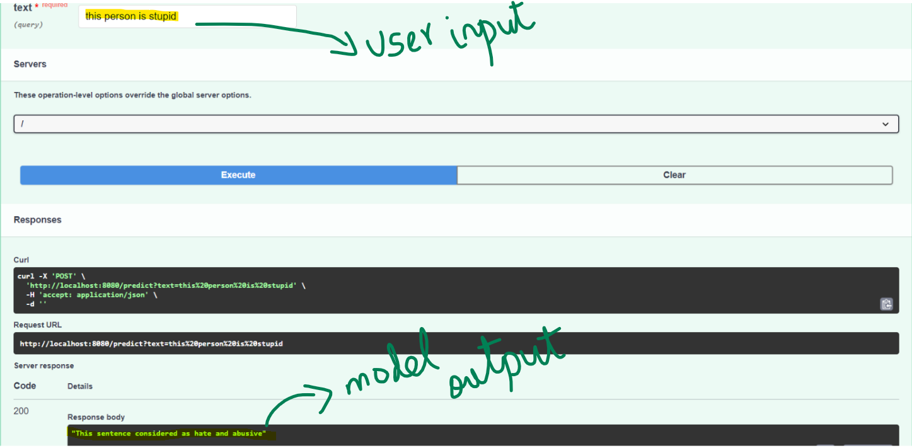
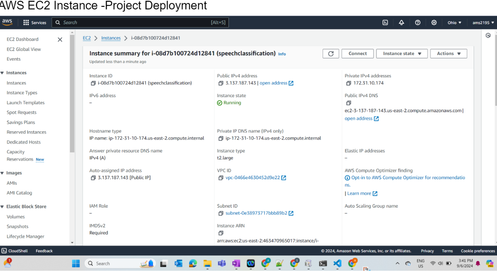
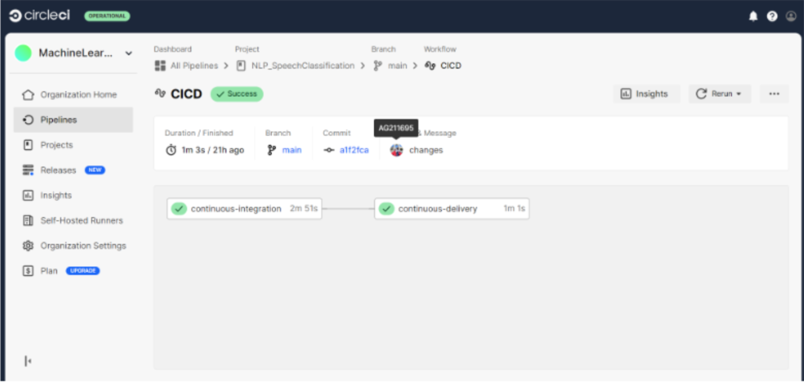
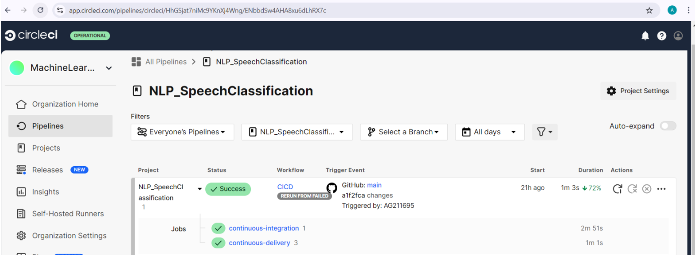

# EndToEnd_NLP_ProjectImplementation

# Hate Speech Detection Project

## Problem Statement
Hate speech on social media and online platforms is a growing concern. It can incite violence, spread negativity, and foster a toxic environment. The objective of this project is to develop an end-to-end deep learning model to automatically classify and detect hate speech from normal speech. This system can be integrated into social platforms or used as a moderation tool to filter content in real-time, contributing to healthier online interactions.

## Key Use Cases:
- **Social Media Moderation**: Automatically flagging or removing offensive content on platforms like Twitter, Facebook, etc.
- **Content Filtering**: Preemptively filtering hate speech in online forums, blogs, and news comment sections.
- **Sentiment Analysis Enhancement**: Integrating hate speech detection with existing sentiment analysis tools for more refined text analysis.

---

## Models, Tools, and Technologies Used

This project was developed using modern deep learning techniques, software engineering principles, and deployment technologies to ensure scalability, performance, and real-world applicability.

### Tools & Technologies:

#### Environment Setup:
- **VS Code**: For environment setup and code execution.
- **GitHub**: For version control and project management.
  
  

#### Data Processing:
- **Data Ingestion**: Used "Gcloud Buckets" as data storage.
- **Data Merging**: Merged multiple datasets to ensure a balanced and diverse dataset for hate speech detection.
- **Data Validation and Transformation**: Cleaned the text data using natural language processing (NLP) techniques:
  - Tokenization
  - Removing stopwords (using `nltk`)
  - Padding sequences for uniform input length.

#### Model Training:
- **TensorFlow & Keras**: The deep learning framework used to build the classification model.
- **Sequential Model**: Built a sequential neural network architecture with the following layers:
  - **Embedding Layer**: Converts text into dense vectors of fixed size.
  - **LSTM (Long Short-Term Memory)**: A recurrent neural network layer to capture sequence information, making it useful for text data.
  - **Dense Layer**: Final layer with sigmoid activation for binary classification.
  
- **Model Summary**:
  ```python
  Embedding(max_words=100, input_length=max_len)
  LSTM(100, dropout=0.2, recurrent_dropout=0.2)
  Sigmoid activation for classification

#### Model Evaluation:
- **Confusion Matrix**: Used to measure accuracy, precision, recall, and F1-score to assess model performance on test data.
- **Imbalanced Dataset Handling**: Managed dataset imbalance by merging resources and carefully preprocessing the data.
- **API Integration**:
- **FastAPI**: Built an API interface to accept user input (text) and return the classification result (hate speech vs. normal speech).
- **Real-time Classification**: The model can process new inputs efficiently, making it suitable for online applications.
- **Deployment**:
- **AWS EC2**: Hosted the model on a cloud-based virtual machine to enable access through the API.
- **CircleCI**: Implemented a CI/CD pipeline for continuous integration and deployment, ensuring seamless updates to the model and application.
- **Docker**: Containerized the application for easier deployment and scalability.


## Key Takeaways from what I learned from this project
This project provided comprehensive insights into the entire machine learning lifecycle, from data acquisition to deployment in production. Some key takeaways:
#### Data Engineering & Preprocessing:
Merging and cleaning data is a critical step, especially when dealing with imbalanced datasets.
NLP techniques like tokenization, stopword removal, and sequence padding are essential for text-based deep learning models.
Managing data pipeline architecture for smooth data ingestion and transformation.
#### Model Building and Evaluation
LSTM Networks are powerful for sequence-based problems like text classification, especially when handling long sequences.
Importance of managing overfitting using dropout techniques and proper data preprocessing.
Thorough model evaluation using confusion matrices helps ensure balanced performance across both classes (hate speech vs. normal speech).
#### Building APIs with FastAPI
FastAPI is an excellent framework for building fast and scalable APIs that can easily integrate machine learning models.
Learned how to serve models through APIs, allowing real-time classification for end-users.



#### Deployment and CI/CD
Gained experience in cloud computing and deployment with AWS EC2. Understanding how to configure, secure, and monitor cloud services is crucial.
The power of CircleCI for automating the deployment process, making sure that the model can be continuously improved without downtime.
Use of Docker for containerizing applications, simplifying the deployment and scaling process.







#### Project Structuring for Industry Standards
I organized the project with a clear modular structure for data ingestion, data validation, transformation, model training, evaluation, and serving.
Logging and exception handling were critical for tracking errors and maintaining robustness in a production setting.
Separation of configuration, artifacts, and constants to make the project scalable and easy to modify for future extensions.
